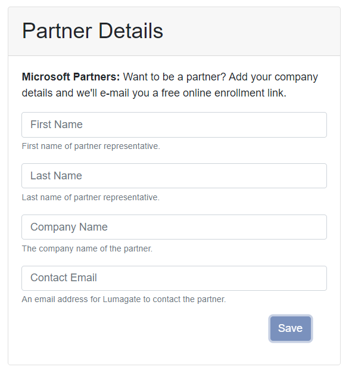

The Registered Partner Program for Lumagate's Resource Scheduler for Microsoft Azure is a simple and free referral partner program designed to help you bring value by helping your customers save money on their Azure IaaS consumption, while maintaining your ongoing customer relationships. Program details and registration below.

## Table of Contents<!-- omit in toc -->

- [Benefits of the Registered Partner Program](#benefits-of-the-registered-partner-program)
- [Program Conditions](#program-conditions)
- [Registration Process](#registration-process)
- [Back to Product Documentation](https://lumagateinc.github.io/Resource-Scheduler/)

## Benefits of the Registered Partner Program<!-- omit in toc -->

The purpose of the partner program for the Resource Scheduler for Microsoft Azure is to enable partners to:

- Play an active role in helping customers save money through recommending and configuring the Resource Scheduler.
- Receive early announcements product announcements, such as new features and updates.
- Receive access to special offers on Resource Scheduler you can share with prospective customers.
- Access to e-mail product support.

If you are a systems integrator focused on Azure, the Resource Scheduler partner program is intended to help you round out your professional services with complementary software every Azure customer can use.

[back to ToC](#table-of-contents)

## Program Conditions<!-- omit in toc -->

Partners agree to abide by the conditions outlined in the registered partner agreement, which you will receive via email. **Complete the registration as described below to receive a copy of the partner agreement.**

[back to ToC](#table-of-contents)

## Registration Process<!-- omit in toc -->

Prospective partners can easily register for Lumagate's Resource Scheduler partner program using the steps below.

1. Install the Resource Scheduler using the steps detailed in the [Product Documentation](https://lumagateinc.github.io/Resource-Scheduler/).

2. Then, on the **Settings** screen, complete the form shown in the figure below with your company and contact info. Click **Save** to save your changes. 

    A contract you can complete and sign electronically will be mailed to you on the next business day.

    

3. **Complete and sign contract**. When you receive the contract, review and sign in the field provided.

4. **Confirm email address**. You will then be added to our partner database, and sent a message to confirm the email address you provided for product-related announcements and offers you may extend to your prospective customers.

**Still have questions?** If you have additional questions, please contact us at [https://lumagate.us/contact](https://lumagate.us/contact). Select "Resource Scheduler" in the product field of our Contact form.

[back to ToC](#table-of-contents)

[Product Documentation](https://lumagateinc.github.io/Resource-Scheduler/)
