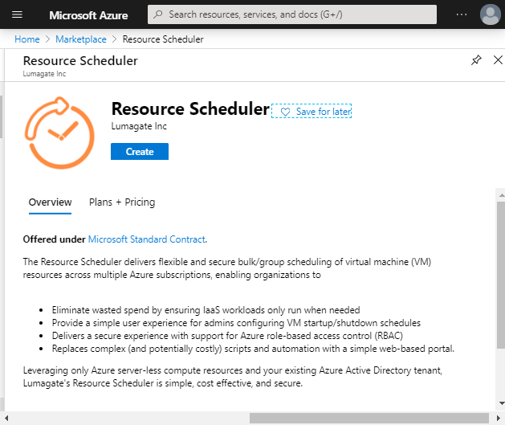
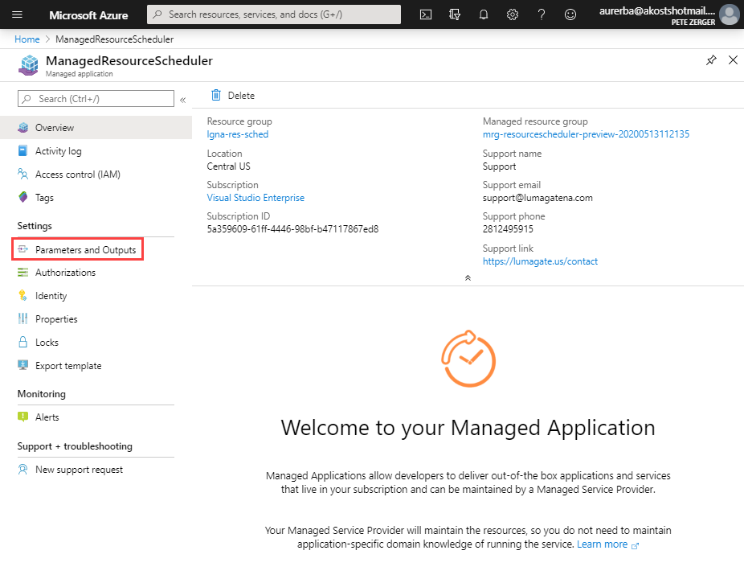
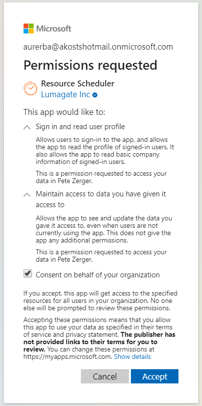
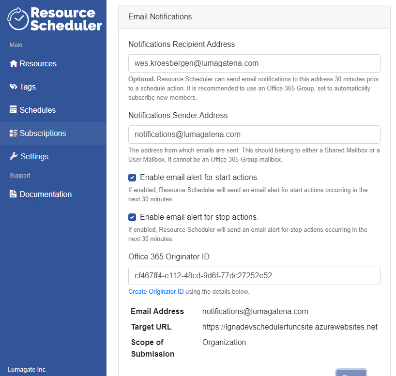
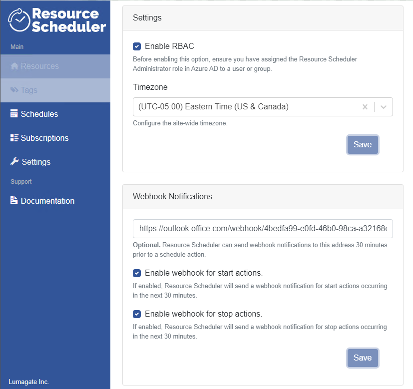
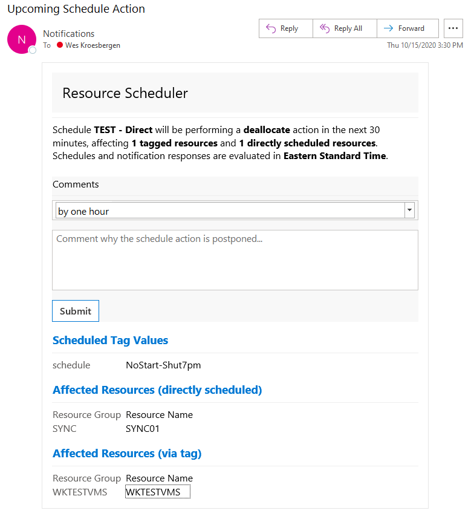
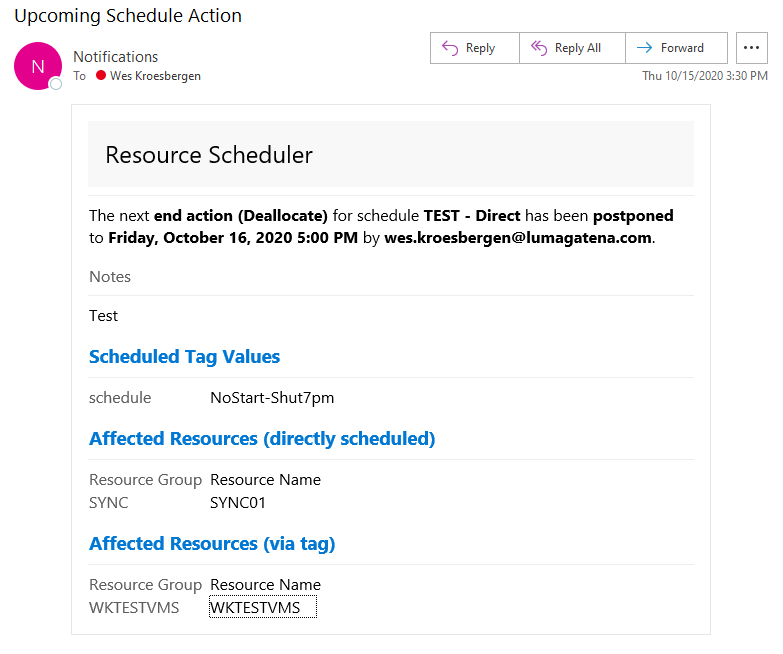
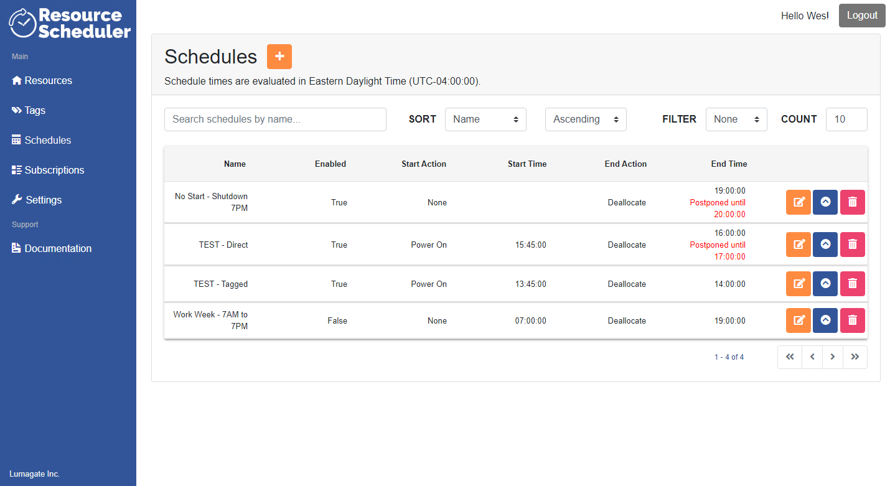
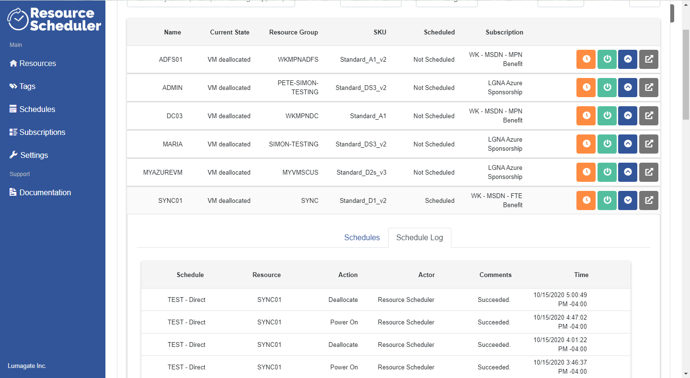
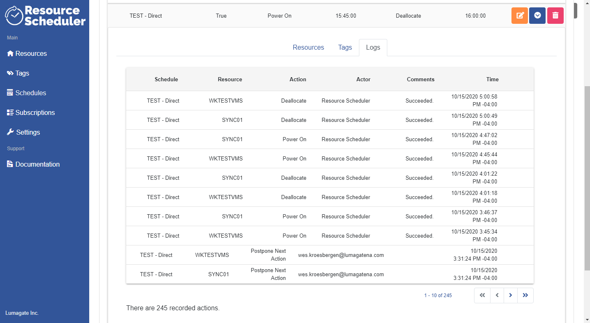

The Resource Scheduler for Microsoft Azure provides a quick and easy way to create group schedules to stop and start Azure VMs on the schedule (days and times) you specify.

> **NOTE**: While additional resource types may be added in the future, "resources" in the current release refers to Azure VMs.

## Table of Contents<!-- omit in toc -->

**VIDEO GUIDANCE**: Installation and configuration video links are available in the [Installation](#installation) and [Configuration](#configuration) sections below. If you do not know the URL of your Resource Scheduler installation, watch the full [Installation & Configuration Instructions HERE](https://youtu.be/_0u8qK9WV0g).

- [A Note on Azure Managed Apps](#a-note-on-azure-managed-apps)
- [Scope of a Resource Scheduler instance](#scope-of-a-resource-scheduler-instance)
- [Install and Configure](#install-and-configure)
  - [Installation](#installation)
  - [Configuration](#configuration)
  - [Grant Permissions](#grant-permissions)
  - [Connect Subscriptions](#connect-subscriptions)
  - [Configure Time Zone](#configure-time-zone)
  - [Email Notifications](#email-notification)
  - [Webhook Notifications](#webhook-notification)
  - [A quick note on Managed Identity](#a-quick-note-on-managed-identity)
- [Managing Schedules](#managing-schedules)
  - [Schedule Resources Directly](#schedule-resources-directly)
  - [Schedule Resources by Tag](#schedule-resources-by-tag)
  - [Postpone Scheduled Action](#postpone-scheduled-run)
- [Troubleshooting, Support, and Resource Admin](#troubleshooting-and-support)
  - [Viewing Resource Logs](#viewing-resource-logs)
  - [Request Support](#request-support)
  - [Start and Stop VMs from Resource Scheduler](#start-and-stop-vms-from-resource-scheduler)
- [Resource Scheduler Licensing](#resource-scheduler-licensing)  
- [Frequently Asked Questions](#frequently-asked-questions)
- [Referral Partner Program](#referral-partner-program)

## A Note on Azure Managed Apps<!-- omit in toc -->

The Resource Scheduler is an **Azure managed application**, a feature unique to Microsoft Azure. It is similar to a solution template in the Marketplace, with one key difference. With a managed application, the resources are deployed to a resource group that's managed by the publisher of the app (Lumagate, in this case), so we can ensure your app is always up-to-date. The resource group is present in your subscription, but an identity in the publisher's tenant has access to the resource group.

>**IMPORTANT**: This does NOT grant Lumagate permissions of any kind over your resources outside the resource group hosting the Resource Scheduler.

[back to ToC](#table-of-contents)

## Scope of a Resource Scheduler instance<!-- omit in toc -->

A Resource Scheduler instance is associated to a single Azure Active Directory (AD) tenant. A Resource Scheduler instance can manage schedules for starting and stopping VMs in Azure connected subscriptions associated with an Azure AD tenant. In other words:

- Resource Scheduler has a 1-1 relationship with your Azure AD tenant.
- Resource Scheduler has a 1-many relationship with your Azure subscriptions associated to that Azure AD tenant.

[back to ToC](#table-of-contents)

## Install and Configure<!-- omit in toc -->

This section covers the initial installation and configuration of the Resource Scheduler.

### Installation<!-- omit in toc -->

INSTALLATION VIDEO WALKTHROUGH: Available [HERE](https://youtu.be/RcYINjkH9jE)

Written version of Resource Scheduler installation steps is available immediately below.

1. Browse to the Azure portal at [https://portal.azure.com](https://portal.azure.com). Login using an account with Global Administrator rights.

2. In the search box at the top of the browser window, type "Marketplace". Select the **Marketplace** icon to go to the Azure Marketplace.

3. In the Marketplace search box, type "Resource Scheduler".

4. Click the "Resource Scheduler" tile in the search results.

5. To install the Resource Scheduler, click the **Create** button.

    

    **FIGURE 1**. Resource Scheduler in the Azure Marketplace

6. In the boxes provided, specify the subscription, resource group name, and an the Azure region where the Resource Scheduler will reside.

7. Then, click the **Next : General Settings** button.

    

    **FIGURE 2**. Subscription, Resource group, and Azure region

8. Specify a value for the **Resource Prefix**. This can be any unique random alpha string up to 8 characters. (no numbers or special characters are supported).

    >**IMPORTANT**: Microsoft *requires* that the site URL is globally unique, so do not pick a common name or string others might use!

9.  In the Location for Application Insights field, specify the same region you selected when specifying a resource group name.

    

    **FIGURE 3**. Resource group prefix and App Insights region

10. To deploy the Resource Scheduler, click **Review + create**.

    

    **FIGURE 4**. Agreement and Deployment

11. Once the deployment begins, you will see the "Your deployment is underway" screen shown in Figure 5.

    

    **FIGURE 5**. Resource Scheduler in Azure

12. When the deployment is complete, you will see the "Welcome to your Managed Application" screen shown in Figure 6.

    

    **FIGURE 6**. Resource Scheduler in Azure

13. Now, click on the **Parameters and Outputs** link in the left navigation menu (shown in Figure 7). You will find the URL of your Resource Scheduler instance in the lower right.

    

14. Copy the URL to the clipboard (shown in Figure 7).

    >**NOTE**: The current limitations of the Azure Managed Application framework make this a necessary step to retrieve your site URL.

    

    **FIGURE 7**. Deployment outputs (website name)

15. Paste the link into a web browser. (The Resource Scheduler has been tested in Edge, Chrome, Firefox, and Safari)

16. Click **Login** button in the upper right, and provide your Azure AD credentials.

17. You will then be prompted to allow the Resource Scheduler to read your profile information. Check the box and click **Accept**.

    >**NOTE**: This consent only affects your user account, and is the minimum required for any Azure app you login to.

    

    **FIGURE 8**. Profile read access

You are now ready to configure schedules and add resources (VMs) to them.

[back to ToC](#table-of-contents)

## Configuration<!-- omit in toc -->

CONFIGURATION VIDEO WALKTHROUGH: Available [HERE](https://youtu.be/Gm4XVYBKfxA)

Written version of Resource Scheduler configuration steps is available in the sections below.

[back to ToC](#table-of-contents)

### Grant Permissions<!-- omit in toc -->

The Resource Scheduler includes custom roles based on Azure role-based access control. Roles include:

- **Administrator**. Enables a user to manage schedules for resources to which they have access, as well as to schedule. Additionally, this role can add additional subscriptions to the Resource Scheduler instance.
- **Schedule Manager**. Enables a user to manage schedules for resources to which they have access, as well as to schedule.
- **Auditor**. This role has read-only access to resources, schedules, logs, and subscriptions connected to the Resource Scheduler instance.

> **IMPORTANT NOTE:** Since the **Scheduler Manager** role can schedule based on Tags, a member of this role may be able to schedule resources they cannot see. This issue also exists when using tags with script or runbook-based scheduling, because Azure does not support RBAC for tags.

*To assign a Resource Scheduler role to a user or group, perform the following steps:*

1. In the Azure portal or Office 365 Admin Center, select **Azure Active Directory**.
2. Then, select Enterprise Applications. From the list, find and select Resource Scheduler (shown in Figure 9 below).
3. Click **Add user > Users and Groups**. Then, select the user or group you wish to add the role. Click **Select** to save your changes.
4. Next, click **Select Role**, and choose the role you would like to assign to the selected user or group (Administrator, Auditor, or Schedule Manager). Click **Select** to save your changes.

**FIGURE 9**. Enterprise Apps list in Azure Active Directory

Menu appearance will vary by role assignment. Member of the **Administrator** role will see the Subscriptions and Settings menus, as shown in Figure 10.

**FIGURE 10**. Enterprise Apps list in Azure Active Directory

[back to ToC](#table-of-contents)

### Connect Subscriptions<!-- omit in toc -->

You can associate multiple subscriptions to a single Resource Scheduler instance. The only requirement is that the subscriptions are associated to the same Azure AD tenant as the Resource Scheduler instance.

*To connect a new subscription to the Resource Scheduler instance, perform the following steps:*

1. From the left menu, select **Subscriptions**.
2. From the **Available Subscriptions**, find the subscription you want to add.
3. Click the blue add  button next to the right of the subscription. Click **Connect** to confirm the change.

>**NOTE**: It can take up to 5 minutes after you deploy Resource Scheduler for the managed identity to be linked to the database. If you receive the error "The Managed Identity for Resource Scheduler has not been updated in the database yet.", simply wait about 5 minutes and try again.

*To **disconnect** a subscription to the Resource Scheduler instance, perform the following steps:*

1. From the left menu, select **Subscriptions**.
2. From the **Connected Subscriptions**, find the subscription you want to remove.
3. Click the red disconnect  button next to the right of the subscription. Click **Disconnect** to confirm the change.

[back to ToC](#table-of-contents)

### Configure Time Zone<!-- omit in toc -->

The time zone settings determines the time zone by which schedules will be set and displayed in the Resource Scheduler portal. Only a user in the Resource Scheduler Administrator role can change this setting.

*To connect a new subscription to the Resource Scheduler instance, perform the following steps:*

1. From the left menu, select **Settings**.
2. Under **Timezone**, select the desired time zone.
3. Click **Save** to save your changes.

**IMPORTANT!** If you change the Timezone setting after configuring schedules, it will change the time by which all schedules are evaluated! This should be clear from the time zone notices throughout the Resource Scheduler portal, but we wanted to mention it again here! :grin:

[back to ToC](#table-of-contents)

## Email Notifications<!-- omit in toc -->

You can configure the Resource Scheduler to send email notification of upcoming schedule actions from Office 365. Because the notifications are delivered in adaptive cards, they are actionable! You can postpone the next run of a schedule from this notification as described in "[Postpone Scheduled Action](#postpone-scheduled-run)".

To configure email notification:
1. In the Resource Scheduler site, select the **Settings** tab.
2. In the **Notifications Sender Address** box, enter the address of a user or shared mailbox from your Office 365 subscription.
3. In the **Notifications Sender Address** box, enter a valid user or distribution list email address.
4. To generate the **Office 365 Originator ID**, click the **Create Originator ID** link beneath the box.
5. Click the **Save** button at the bottom of the screen to save your changes.

**FIGURE 11**. Email Notifications configuration on Settings tab

[back to ToC](#table-of-contents)

## Webhook Notifications<!-- omit in toc -->

You can configure notification of upcoming schedule actions to Microsoft Teams via webhook. Because the notifications are delivered in adaptive cards, they are actionable! You can postpone the next run of a schedule from this notification as described in "[Postpone Scheduled Action](#postpone-scheduled-run)".

To configure actionable webhook notifications:

1. Open Microsoft Teams and select the team you would like to receive notifications.
2. Click the ellipsis (...) next to the team name and select **Manage team**.
3. Select the **Apps** tab.
4. If you do not see webhooks in the list, click the **More apps** button.
5. In the search box , type 'webhook'. From the search results, select 'Incoming Webhook' and click the **Add to a team** button.
6. On the 'Setup an incoming Webhook...', click the **Setup a connector** button.
7. On the Incoming Webhook screen, click **Create**. Then, copy the URL, as shown in the figure below.

**FIGURE 12**. Webhook URL in Teams

8. To complete the configuration, go back to the **Settings** tab of the Resource Scheduler.
9. Paste the URL from step 7 into the box provided in the 'Webhook Notifications' area.
10. Check the 'Enable webhook for start actions' and 'Enable webhook for stop actions' according to your preference.
11. Click the **Save** button at the bottom of the screen to save your changes.

> **NOTE**: While you can configure notifications for stop and start actions independently, you must select start notifications to enable the option to postpone schedule runs from these notifications.

**FIGURE 13**. Webhook Notifications configuration on Settings tab

[back to ToC](#table-of-contents)

## A quick note on Managed Identity<!-- omit in toc -->

To complete scheduled actions, the Resource Scheduler uses a **managed identity**. The managed identity is an account in the customer's Azure Active Directory (AD) that only Azure / Azure AD know the password of, similar to the Managed Service Account in Active Directory. 

When you connect a subscription, you authorize this account to have rights to the subscription, allowing it to start, stop, and inventory VMs and tags without a user signed in. This is useful when the schedule kicks off before/after working hours, when you are not sitting at your computer.

[back to ToC](#table-of-contents)

## Managing Schedules<!-- omit in toc -->

This section describes how to schedule resources for start and stop at the days and times you specify. There are two approaches for scheduling resources:

1. **Scheduling resources directly**. With directly scheduling, you associate VMs to a schedule one at-a-time, using a simple search interface. *This is great for smaller environments or schedules that affect a small number of VMs.* See ["Schedule Resources Directly"](#schedule-resources-directly) for configuration steps.
2. **Scheduling by tag**. This option will automatically associate the schedule to all Azure VMs with the tag you specify. *This is the preferred option for bulk scheduling and large environments.* See ["Schedule Resources by Tag"](#schedule-resources-by-tag) for configuration steps.

> **A note on multiple schedules**. You can assign multiple schedules through direct assignment or using tags.

[back to ToC](#table-of-contents)

### Schedule Resources Directly<!-- omit in toc -->

Associating resources to schedules directly is the preferred method for managing small numbers of VMs, as explained in [Managing Schedules](#managing-schedules) above.

*To add VMs to a schedule, perform the following steps:*

1. From the left menu, select **Schedules**.
2. Click the plus (+) sign by **Schedules**, shown in Figure 11 below. This will bring up the schedule form.
3. Complete the values in the schedule form.
4. Add VMs in the Resources field, using the search and list controls, shown in Figure 14 below.
5. Click **Save** to save your changes.

**FIGURE 14**. Schedule menu in Resource Scheduler

**FIGURE 15**. Adding VM resources directly to a schedule

[back to ToC](#table-of-contents)

### Schedule Resources by Tag<!-- omit in toc -->

Associating schedules to resources with Azure tags is the preferred method for managing large numbers of resources as explained in [Managing Schedules](#managing-schedules) above. The Resource Scheduler looks for the tag values you specify when associating a schedule to a tag. If you are not familiar with tags in Azure, see ["Use tags to organize your Azure resources"](https://docs.microsoft.com/en-us/azure/azure-resource-manager/management/tag-resources#portal).

> **IMPORTANT REMINDER!** To avoid confusion and unintentional scheduling of VMs, the Resource Scheduler will look for tags **only on the VM resource itself**!

*To associate a tag to a schedule, perform the following steps:*

**First, you will create the schedule:**

1. From the left menu, select **Schedules**.
2. Click the plus (+) sign by **Schedules**. This will bring up the schedule form.
3. Complete the values in the schedule form. Leave the **Resources** field blank.
4. Click **Save** to save your changes.

**Next, you will associate the schedule to tags:**

1. From the left menu, select **Tags**.
2. In the **Available Tags** list, find the tag name associated to the resources you wish to schedule.
3. To the right of your tag, click the orange **Schedule tag** button, shown in Figure 16. This will bring up the schedule form.
4. In the **Schedule Trigger Values** field, add one or more tag values that will trigger schedule actions. *The tag values are provided to you in the dropdown list, shown in Figure 17 below.*
5. In the** Attached Schedules** field, select the desired schedule or schedules from the dropdown list. 
6. Click **Save** to save your changes.

**FIGURE 16**. Adding VM resources to a schedule using tags

**FIGURE 17**. Associating tag values to the schedule

[back to ToC](#table-of-contents)

### Postpone Scheduled Action<!-- omit in toc -->

If you need to use a VM outside currently scheduled hours, you can postpone a scheduled run using the actionable message card in the email notification (in Outlook) or webhook notification (in Teams).

1. To postpone the next scheduled action, use the dropdown in the notification. 
2. Choose from 'by one hour', 'by two hours', 'by four hours', or 'until next run'.
3. Add a comment noting the reason for the delay (optional).
4. Click the **Submit** button to enforce your selection. 

You can view postponed schedule actions in the Resource Scheduler portal, as shown in **Figure 17**.

**FIGURE 15**. Postpone schedule from email (before)

5. After you submit your update, you can view the status of your request in the body of this message by pressing F5 to refresh the card.

**FIGURE 16**. Postpone schedule from email (after)

**FIGURE 17**. Postponed schedule actions (in red)

## Troubleshooting and Support<!-- omit in toc -->

This section details where to view logs related to Resource Scheduler operation, as well as how to ask a question or request support.

### Viewing Resource Logs<!-- omit in toc -->

You can view activity logs from multiple perspectives, as described here.

*To view logs related to a resource or schedule, perform the following steps:*

1. From the left menu, select **Schedules**.
2. Click the **Expand details** icon to the right of the resource (VM) in question.
3. Select the **Logs** tab to see log entries, as shown in **Figure 18**.

**FIGURE 18**. Postponed schedule actions (in red)

Events are listed in descending order (newest event at the top).

*To view the central activity log, perform the following steps:*
1. From the left menu, select **Logs**. Log entries are immediately available, as shown in **Figure 19**.

**FIGURE 19**. Postponed schedule actions (in red)

[back to ToC](#table-of-contents)

### Request Support<!-- omit in toc -->

E-mail support is available to Resource Scheduler customers.

*To request support, perform the following steps:*

>**NOTICE OF SUPPORT HOURS**: Support hours for Resource Scheduler are 8am - 6pm Eastern Time, Monday-Friday.

**STEP 1: Check the FAQs**

Begin by checking our [FAQs Page](/FAQs.md) to see if your question is answered there. If it is not, proceed to STEP 2.

**STEP 2: Screenshot your Claims**

Visit **[https://\<tenant\>.azurewebsites.net/claims](https://\<tenant\>.azurewebsites.net/claims)** and capture a screenshot of the claims associated with your account. If you are logging a request for another user, ask them to capture this data and forward to you.

> **IMPORTANT!** Be sure to complete this step. Your support analyst may ask for this information.

**STEP 3: Log a ticket**

To log a ticket, visit our [Support page](https://lumagate.us/support) at [https://lumagate.us/support](https://lumagate.us/support) and click the "CONTACT US" button. In the form provided, select "Resource Scheduler" in the **Product** dropdown. Complete the required fields in the form and click **Submit**. A support ticket will be logged and routed automatically. You will receive an e-mail confirmation that your request was received.

[back to ToC](#table-of-contents)

## Start and Stop VMs from Resource Scheduler<!-- omit in toc -->

If desired, you can start and stop VMs on-demand directly from the Resource Scheduler portal.

*To start or stop a VM, perform the following steps:*

1. From the left menu, select **Resources**.

2. Then, click the Start or Stop button as appropriate. Which button appears depends on the current state of the VM:
   - The **Start** button  only appears for VMs currently in a *stopped* or *deallocated* state.
   - The **Stop** button  only appears for VMs currently in a *running* state.

3. Press the appropriate button to start or stop the VM in Figure 17.

   - **To START a VM:** Click the green  button next to the right of the VM resource. Click the green start button again in the prompt to confirm the action.
   - **To STOP a VM:** Click the stop  button next to the right of the VM resource. Click the red stop button again in the prompt to confirm the action.

> **NOTE**: The state of the VM may take up to 5 minutes after button press to reflect the change in state, as mentioned on the confirmation screen.

**FIGURE 17**. Start and Stop buttons for VM resources

[back to ToC](#table-of-contents)

## Resource Scheduler Licensing<!-- omit in toc -->

Resource scheduler is licensed according to the number of resources (VMs) you need to schedule. For pricing information, see ["Resource Scheduler Licensing"](https://lumagate.us/azure/pricing) on the Lumagate website.

[back to ToC](#table-of-contents)

## Frequently Asked Questions<!-- omit in toc -->

Frequently asked questions are maintained on our [FAQs Page](/FAQs.md)

[back to ToC](#table-of-contents)

## Referral Partner Program<!-- omit in toc -->

Prospective partners can learn more about Lumagate's Resource Scheduler partner program on our [Referral Partner Program](Partners.md) page.

[back to ToC](#table-of-contents)